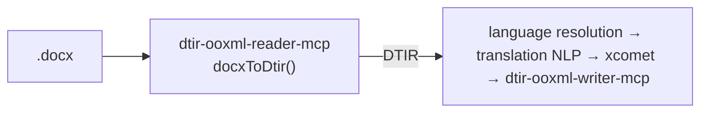

[日本語](./README.md) | **English**

# @shuji-bonji/dtir-ooxml-reader-mcp

An MCP server that converts `.docx` (WordprocessingML) into a **DTIR segment table**.
The entry point of the mixed-language document translation pipeline. It outputs `doc-translation-ir` contract v0.1.



## What it does / does not do

- **Does**: unzip → walk `word/document.xml` + `header*/footer*` → segment paragraphs.
  Extract only `<w:t>` text. Reconcile language by tag × local detection (tinyld). Derive the id
  deterministically from the anchor. Record run-split offsets in `text.runs`.
- **Does not**: translate (that is a later stage's job). Never touch formatting, images, or `sectPr` — hide them in anchor.ref.

## Classification rules

| Paragraph | Decision | Result |
|---|---|---|
| Complex field (has `<w:fldChar>`) | TOC/PAGE etc. | `translatable:false` / `skipReason:field` |
| Numbers/symbols only | Contains no letters, contains digits | `translatable:false` / `skipReason:numeric` |
| Empty | No text | `translatable:false` / `skipReason:empty` |
| Otherwise | — | `translatable:true`, run language resolution |

## Language resolution priority

1. **Explicit run-level `<w:lang w:val>`** (not inherited default) → `source:tag`
2. Otherwise **tinyld detection** (accuracy threshold 0.2) → `source:detect`
3. Undetectable / short text → **container default** (styles' docDefaults) → `source:default`

> Why tinyld: franc often misdetects short text (mistaking German for French) and broke on the fixture's
> `body-de-notag` (a German paragraph with a missing tag). tinyld returns ISO 639-1 + an accuracy score.

## Usage

MCP tool `docx_to_dtir`:

```jsonc
{ "docxBase64": "<base64 .docx>", "fileName": "x.docx", "targetLang": "en-GB" }
// → returns DTIR(IRDocument) as JSON
```

Library:

```ts
import { docxToDtir } from '@shuji-bonji/dtir-ooxml-reader-mcp/reader';
const dtir = await docxToDtir(buf, { fileName: 'x.docx', targetLang: 'en-GB' });
```

## Connecting as an MCP server

Build (polyrepo: place `doc-translation-ir` next to it **at build time only**; type-only dependency, so **not needed at runtime**):

```sh
git clone https://github.com/shuji-bonji/doc-translation-ir.git
git clone https://github.com/shuji-bonji/dtir-ooxml-reader-mcp.git
cd dtir-ooxml-reader-mcp && npm install   # `prepare` auto-builds → dist/index.js (rebuild with npm run build)
```

### Claude Desktop (`claude_desktop_config.json`)

```jsonc
{
  "mcpServers": {
    "dtir-ooxml-reader": {
      "command": "node",
      "args": ["/ABS/PATH/dtir-ooxml-reader-mcp/dist/index.js"]
    }
  }
}
```

### Claude Code

```sh
claude mcp add dtir-ooxml-reader -- node /ABS/PATH/dtir-ooxml-reader-mcp/dist/index.js
```

Provided tool: **`docx_to_dtir`** (base64 docx → DTIR)

## Tests

- `npm test` — vitest (the main invariants)
- `npm run test:fixture` — the acceptance test against `doc-translation-ir`'s fixtures
  (4 stages: JSON Schema → validate-dtir → groundtruth → id determinism)

## PoC notes

- The DTIR type depends on `@shuji-bonji/doc-translation-ir` (the shared contract). The output is also validated against the JSON Schema, so drift is detected.
- For the v0.1 known limitations (intra-paragraph language switching, inline-formatting collapse), see DTIR README §8.
