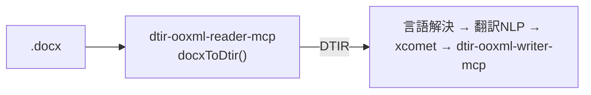

**日本語** | [English](./README.en.md)

# @shuji-bonji/dtir-ooxml-reader-mcp

`.docx`（WordprocessingML）を **DTIR セグメント表**に変換する MCP サーバ。
混在言語ドキュメント翻訳パイプラインの入口。`doc-translation-ir` の契約 v0.1 を出力する。



## やること / やらないこと

- **やる**: unzip → `word/document.xml` ＋ `header*/footer*` を走査 → 段落をセグメント化。
  `<w:t>` のテキストのみ抽出。言語をタグ×ローカル判定(tinyld)で調停。id を anchor から
  決定的に導出。ラン分断のオフセットを `text.runs` に記録。
- **やらない**: 翻訳しない（後段の責務）。書式・画像・`sectPr` は触らず anchor.ref に隠す。

## 分類ルール

| 段落 | 判定 | 結果 |
|---|---|---|
| 複合フィールド（`<w:fldChar>` あり） | TOC/PAGE 等 | `translatable:false` / `skipReason:field` |
| 数値・記号のみ | 文字を含まず数字を含む | `translatable:false` / `skipReason:numeric` |
| 空 | テキストなし | `translatable:false` / `skipReason:empty` |
| それ以外 | — | `translatable:true`、言語解決を実行 |

## 言語解決の優先順位

1. **明示 run-level `<w:lang w:val>`**（既定の継承ではない）→ `source:tag`
2. なければ **tinyld 判定**（accuracy 閾値 0.2）→ `source:detect`
3. 判定不能/短文 → **コンテナ既定**（styles の docDefaults）→ `source:default`

> tinyld 採用理由: franc は短文で誤判定（独語文を仏語に誤る）が多く、フィクスチャの
> `body-de-notag`（タグ欠落の独語段落）で破綻したため。tinyld は ISO 639-1 ＋ accuracy を返す。

## 使い方

MCP tool `docx_to_dtir`:

```jsonc
{ "docxBase64": "<base64 .docx>", "fileName": "x.docx", "targetLang": "en-GB" }
// → DTIR(IRDocument) を JSON で返す
```

ライブラリ:

```ts
import { docxToDtir } from '@shuji-bonji/dtir-ooxml-reader-mcp/reader';
const dtir = await docxToDtir(buf, { fileName: 'x.docx', targetLang: 'en-GB' });
```

## MCP サーバとして接続

ビルド（polyrepo: **build 時だけ** `doc-translation-ir` を隣に置く。型のみ依存なので**実行時は不要**）:

```sh
git clone https://github.com/shuji-bonji/doc-translation-ir.git
git clone https://github.com/shuji-bonji/dtir-ooxml-reader-mcp.git
cd dtir-ooxml-reader-mcp && npm install   # prepare で自動ビルド → dist/index.js（再ビルドは npm run build）
```

### Claude Desktop（`claude_desktop_config.json`）

```jsonc
{
  "mcpServers": {
    "dtir-ooxml-reader": {
      "command": "node",
      "args": ["/ABS/PATH/dtir-ooxml-reader-mcp/dist/index.js"]
    }
  }
}
```

### Claude Code

```sh
claude mcp add dtir-ooxml-reader -- node /ABS/PATH/dtir-ooxml-reader-mcp/dist/index.js
```

提供ツール: **`docx_to_dtir`**（base64 docx → DTIR）

## テスト

- `npm test` — vitest（主要不変条件）
- `npm run test:fixture` — `doc-translation-ir` のフィクスチャに対する受け入れテスト
  （JSON Schema → validate-dtir → groundtruth → id 決定性 の4段）

## PoC の注意

- DTIR 型は `@shuji-bonji/doc-translation-ir` に依存（共有契約）。出力は JSON Schema でも検証するためドリフトは検出される。
- v0.1 の既知の制限（段落内言語切替・インライン書式 collapse）は DTIR README §8 を参照。
