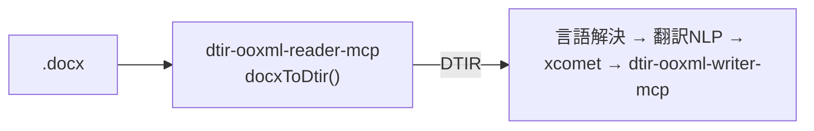

**日本語** | [English](./README.en.md)

# @shuji-bonji/dtir-ooxml-reader-mcp

`.docx`（WordprocessingML）を **DTIR セグメント表**に変換する MCP サーバ。
混在言語ドキュメント翻訳パイプラインの入口。`doc-translation-ir` の契約 v0.1 を出力する。



## やること / やらないこと

- **やる**: unzip → `word/document.xml` ＋ `header*/footer*` を走査 → 段落をセグメント化。
  `<w:t>` のテキストのみ抽出。言語をタグ×ローカル判定(tinyld)で調停。id を anchor から
  決定的に導出。ラン分断のオフセットを `text.runs` に記録。
- **やらない**: 翻訳しない（後段の責務）。書式・画像・`sectPr` は触らず anchor.ref に隠す。

## 分類ルール

| 段落 | 判定 | 結果 |
|---|---|---|
| 複合フィールド（`<w:fldChar>` あり） | TOC/PAGE 等 | `translatable:false` / `skipReason:field` |
| 数値・記号のみ | 文字を含まず数字を含む | `translatable:false` / `skipReason:numeric` |
| 空 | テキストなし | `translatable:false` / `skipReason:empty` |
| それ以外 | — | `translatable:true`、言語解決を実行 |

## 言語解決の優先順位

1. **明示 run-level `<w:lang w:val>`**（既定の継承ではない）→ `source:tag`
2. なければ **tinyld 判定**（accuracy 閾値 0.2）→ `source:detect`
3. 判定不能/短文 → **コンテナ既定**（styles の docDefaults）→ `source:default`

> tinyld 採用理由: franc は短文で誤判定（独語文を仏語に誤る）が多く、フィクスチャの
> `body-de-notag`（タグ欠落の独語段落）で破綻したため。tinyld は ISO 639-1 ＋ accuracy を返す。

## confidence の意味

`language` は `{ value, confidence, source }` の3点セット。**`confidence` は単独の数値ではなく
`value`（その言語）への確信度**（0–1）であり、必ず `source`（出所）とセットで読む。

| 状況 | value | confidence | source |
|---|---|---|---|
| 明示タグ `<w:lang>` あり | タグの言語 | **0.95**（固定・強い証拠） | tag |
| タグ無し → tinyld 検出成功（accuracy ≥ 0.2 かつ既知言語） | 検出言語 | **tinyld の accuracy**（可変・約0.2〜1.0） | detect |
| 検出不発 → コンテナ既定 | 既定言語 | **0.3**（固定・弱い証拠＝継承） | default |
| 既定も無い／検出不能 | **null** | **0** | default |
| field / numeric / empty（翻訳対象外） | **null** | **0** | — |

読み方の要点:

- **固定値は「証拠の種類」が信頼度を決めるため**。タグ＝人/ツールの明示宣言なので高(0.95)、継承＝弱い手掛かりなので低(0.3)。**accuracy をそのまま反映する可変値は検出(detect)経路のみ**。
- **`value=null` のとき `confidence=0` は正しい**。confidence は「value への確信度」なので、言語を主張していない（null）なら確信対象が無く 0 になる。**「0＝言語情報が信用できない」ではなく「0＝そもそも言語を主張していない」**と読む。
- 下流は **`translatable` と `value` を先に見る**こと。`translatable=false`（field/numeric/empty）は言語を使わずスキップするので、その `confidence=0` を「不確実な言語」と解釈してはならない。
- **候補分布 `candidates` の保持**: 検出が不採用（accuracy < 0.2、または8言語マップ外）でコンテナ既定や
  `null` にフォールバックする場合でも、tinyld の候補分布（上位3件）を `candidates` に残す。
  `value`/`confidence`/`source` の意味論は変えず（既定⇒0.3, null⇒0）、**検出器の見立てだけを下流へ渡す**。
  完全に検出不能（`detectAll` が空）なら `candidates` は付けない＝「すべて失敗」は空のまま。
  なお現状 `confidence`/`candidates` を読む下流ステージは未実装で、これは将来の言語解決ステージ向けの信号保全。

## 保証すること / 保証しないこと

### 保証する

- **ロスレス（非破壊）**: 抽出するのは `<w:t>` のテキストのみ。書式(rPr)・画像(DrawingML)・`sectPr`・
  フィールド命令は IR に乗せず `anchor.ref` に隠すため、**reader 由来で文書が壊れることはない**。
- **id の決定性**: 同一入力なら再実行しても各セグメントの `id` は不変（`anchor` の part＋構造パスから導出）。
  段落が増減しても既存 id がズレないので、増分翻訳・キャッシュが成立する。
- **構造網羅（再帰走査）**: `document.xml` / `header*` / `footer*` / `footnotes.xml` / `endnotes.xml` を走査し、
  表(`w:tbl/w:tr/w:tc`)・SDT・テキストボックス内の段落まで再帰収集。ハイパーリンク・追跡変更(`w:ins`)内の
  ランも連結して**文を分断しない**（`w:del` は除外）。→ torture フィクスチャで 0 漏れを常設テスト。
- **契約適合**: 出力は `doc-translation-ir` の **JSON Schema（構造）と validate-dtir（意味整合）の両方**を満たす。
- **fail-safe な分類**: 翻訳対象外（field/numeric/empty）は `translatable=false` で明示し writer は一切触らない。
  未対応領域は「原語のまま残る」安全側に倒れ、レイアウト崩壊や誤訳混入を起こさない。

### 保証しない

- **翻訳しない**: 言語解決のヒントを付すだけ。翻訳・品質評価は後段の責務。
- **言語の正しさを保証しない**: tinyld は確率的判定で、短文や近縁言語では誤りうる。だからこそ値を断定せず
  `{ value, confidence, source, candidates }` で**不確実性を明示して**下流に委ねる設計。
- **段落内の言語切替を分離しない**: `language` はセグメント単位。1つの `<w:p>` 内で蘭→仏のように
  切り替わっても1言語に丸める（v0.2 で `runs` ＋ ラン別 `language` を想定）。
- **8言語マップ外を解決しない**: BCP47 マップは PoC 範囲（nl / fr / de / en / ja / es / it / pt）。
  範囲外の言語はコンテナ既定または `null` にフォールバックする。
- **段内インライン書式を保持しない（既定 collapse）**: 太字・色などの復元は tag-aware writer（v0.2 以降）まで保留。
  `text.runs` のオフセットは前方互換で記録済み。

## 使い方

MCP tool `docx_to_dtir`:

```jsonc
{ "docxBase64": "<base64 .docx>", "fileName": "x.docx", "targetLang": "en-GB" }
// → DTIR(IRDocument) を JSON で返す
```

ライブラリ:

```ts
import { docxToDtir } from '@shuji-bonji/dtir-ooxml-reader-mcp/reader';
const dtir = await docxToDtir(buf, { fileName: 'x.docx', targetLang: 'en-GB' });
```

## MCP サーバとして接続

ビルド（polyrepo: **build 時だけ** `doc-translation-ir` を隣に置く。型のみ依存なので**実行時は不要**）:

```sh
git clone https://github.com/shuji-bonji/doc-translation-ir.git
git clone https://github.com/shuji-bonji/dtir-ooxml-reader-mcp.git
cd dtir-ooxml-reader-mcp && npm install   # prepare で自動ビルド → dist/index.js（再ビルドは npm run build）
```

### Claude Desktop（`claude_desktop_config.json`）

```jsonc
{
  "mcpServers": {
    "dtir-ooxml-reader": {
      "command": "node",
      "args": ["/ABS/PATH/dtir-ooxml-reader-mcp/dist/index.js"]
    }
  }
}
```

### Claude Code

```sh
claude mcp add dtir-ooxml-reader -- node /ABS/PATH/dtir-ooxml-reader-mcp/dist/index.js
```

提供ツール: **`docx_to_dtir`**（base64 docx → DTIR）

## テスト

- `npm test` — vitest（主要不変条件）
- `npm run test:fixture` — `doc-translation-ir` のフィクスチャに対する受け入れテスト
  （JSON Schema → validate-dtir → groundtruth → id 決定性 の4段）

## PoC の注意

- DTIR 型は `@shuji-bonji/doc-translation-ir` に依存（共有契約）。出力は JSON Schema でも検証するためドリフトは検出される。
- v0.1 の既知の制限（段落内言語切替・インライン書式 collapse）は DTIR README §8 を参照。
